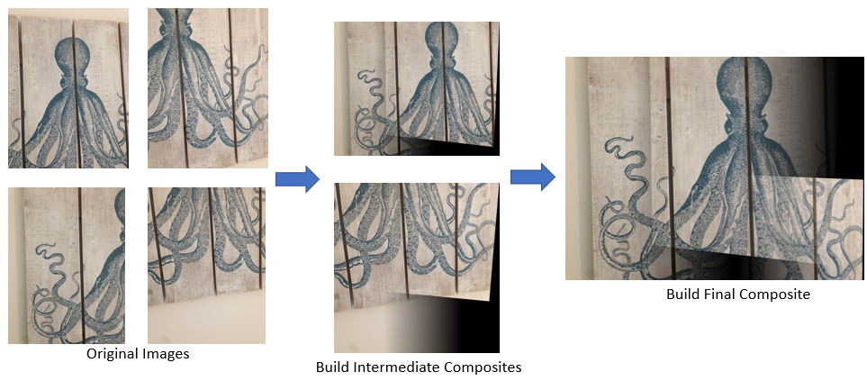
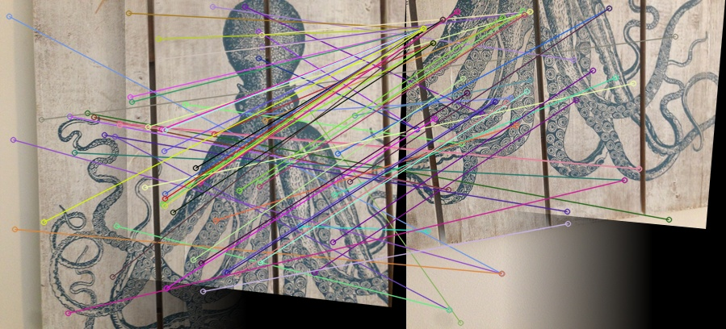

#Harris Detector and Panoramic Building

###image_stiching.py
Stitch images (build panoramic) using Harris Detector and SIFT. 

###harris_detector.py
Implementation of Harris Detector for finding corners.

###opencv_harris_detector.py
Implementation of Harris Detector for finding corners using built-in opencv functions.

###corner_counter.py
Counts and displays numbers of corners found
in each frame of a video (28FPS) using Harris Detector. 
Generates and displays new video at 10 FPS.

###descriptor_utils.py
Keypoint and Descriptor Utilities. Gets SIFT descriptors, homographies, etc.

###harris_utils.py
Harris Detector Utilities. Compute structure matrix, harris response, etc.

###References
- https://github.com/linrl3/Image-Stitching-OpenCV/blob/master/Image_Stitching.py
- https://docs.opencv.org/3.4/d5/dde/tutorial_feature_description.html
- https://opencv-python-tutroals.readthedocs.io/en/latest/py_tutorials/py_feature2d/py_features_harris/py_features_harris.html
- https://muthu.co/harris-corner-detector-implementation-in-python/
- https://github.com/muthuspark/ml_research/blob/master/Process%20of%20Harris%20Corner%20Detection%20Algorithm.ipynb